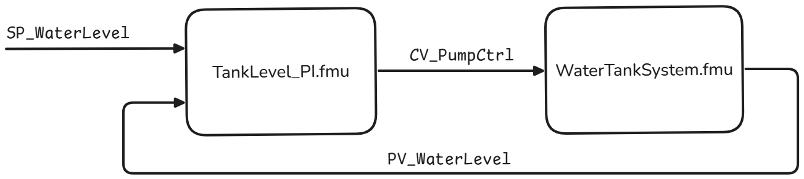
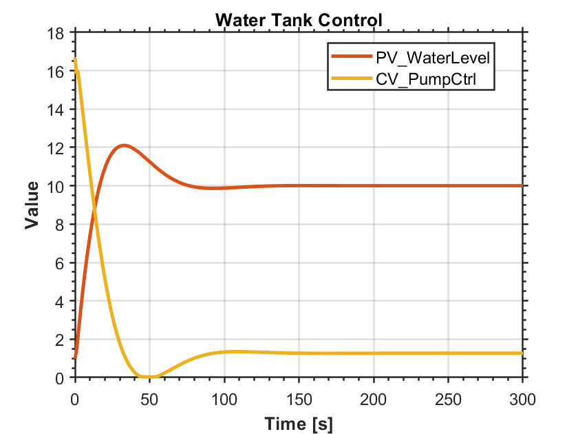

<p align="center">
  <a href="https://github.com/Novia-RDI-Seafaring/opcua-fmu-simulator">
</a>
</p>


<p align="center">
    <b>OPC-UA and FMU Simulator</b> <br />
    Perform X-in-the-Loop (XiL) simulation tests with FMU simulation models and communication over OPC-UA.
</p>

<p align="center">
  <a href="https://www.novia.fi/" target="_blank">
      Novia UAS
  </a>|
  <a href="https://www.utu.fi/en" target="_blank">
      University of Turku
  </a>|
  <a href="https://www.virtualseatrial.fi/" target="_blank">
      Research Project
  </a>|
  <a href="mailto:mikael.manngard@novia.fi?subject=MCP-FMI:">Contact</a>

</p>
<p align="center">
  <a href="https://www.python.org/">
    
  </a>
  <a href="https://opensource.org/licenses/MIT">
    
  </a>
  <a href="https://www.businessfinland.fi/">
    
  </a>
</p>

# OPCUA-FMU Simulator
**Table of content**
- [1. Features](#features)
- [2. Installation](#installation)
- [3. Configurations](#configurations)
    - [3.1. Test configuration](#test-configuration)
    - [3.2. External servers](#external-servers)
- [4.Example usage](#example-usage)
- [5. Other](#other)
    - [5.1. Main contributors](#main-contributors)
    - [5.2. Citation](#citation)
    - [5.3. License](#license)
    - [5.4. Acknowledgements](#acknowledgements)

## Features
- **Simulate FMU models** with OPC-UA communicaiton.
- **Connect external OPC-UA servers**. This allwows FMU models to simulated together with thrid-party hardware and software.
- **Manage tests and violation monitoring** for simulation scenarios.


## Installation

### Prerequisites
- Python 3.11 or higher
- [uv](https://docs.astral.sh/uv/) package manager

### Quick Setup with uv (Recommended)

1. **Install uv** (if not already installed):
   ```powershell
   # Windows PowerShell
   irm https://astral.sh/uv/install.ps1 | iex
   ```

2. **Clone the repository**:
   ```bash
   git clone https://github.com/Novia-RDI-Seafaring/opcua-fmu-simulator.git
   cd opcua-fmu-simulator
   ```

3. **Install the project and all dependencies**:
   ```bash
   uv sync
   ```

   This single command will:
   - Create a virtual environment automatically
   - Install all required dependencies
   - Install the OPCUA-FMU-Simulator package in editable mode
   - Create a lock file for reproducible installs

4. **Activate the virtual environment** (if needed):
   ```powershell
   # Windows
   .venv\Scripts\Activate.ps1
   
   # Linux/macOS
   source .venv/bin/activate
   ```

## Running Examples

The preconfigured tests, `test01.yaml` and `test02.yaml`, can be executed directly without any additional setup by simply running `main.py`. 

    python main.py

Currently `main.py` runs all the tests under the `TESTS/` folder. In future versions, this will likely be updated to allow users to specify which tests to run.

For `test03.yaml` to also run you will need to run the remote server that is located under servers:

     
    python servers/example_server.py

 
  Log file should be generated under `log/`.

# System setup

The system automatically sets up an opcua server for every specified FMU. The server's name is the same as that of the FMU "model name" found in model description. The server variables adopt the names of the FMU variables. These variables include inputs, outputs, and overall system parameters, all of which can be configured from the configuration file.


# Configurations


## Test configuration
The test file allows users to configure the following parameters:

- **FMUs** included in the simulation  
- **External OPC UA servers** used  
- **Test parameters:**  
  - Test name  
  - Communication timestep  
  - Simulation or real-time mode  
  - Simulation stop time  
  - Logging (enabled/disabled)  
  - Test description  
- **Initial system inputs** for all FMUs and external servers  
- **Conditions for starting logging**  
- **System loop definition** (from-to)  
- **Simulation evaluation criteria**  

**Example configuration file:**

```yaml
    fmu_files:  [  
                "path01 to your fmu",
                "path02 to your fmu",
                "path03 to your fmu"
                ]

    external_servers: [
                      "path01 to your external server yaml description",
                      "path02 to your external server yaml description",
                      "path03 to your external server yaml description"
                      ]

    test:
      test_name: "a unique test name"
      timestep: 0.5                             # in seconds
      timing:  "simulation_time" or "real_time" 
      stop_time: 100.0                          # duration of the test 
      save_logs: true                           # boolean
      test_description: "a description of the test"

      initial_system_state:
        FMU_Model_Name:
          FMU_input_name1: "desired initial value"
          FMU_input_name2: "desired initial value"
          FMU_input_name3: "desired initial value"

        example_server:
          opcua_object01_variable1: "desired initial value"

      start_readings_conditions:
        condition_name: "FMU_Model_Name.FMU_input_name1 > 10"
        # the object and variable have to be part of a created or external server 
        # operators supported: '+' '-' '<' '<=' '>' '>='

      system_loop: # definition how the systems are connected 
        - from: source_object.source_variable
          to:   target_object.target_variable
        
        - from: source_object.source_variable
          to:   target_object.target_variable

      evaluation: 
        eval_1: "object.value < 11.1"
        eval_2: "object.value > 20"
```

## External Servers

The OPCUA-FMU-Simulator allows users to integrate external servers alongside their FMUs. These servers are specified in the configuration file under the external server section using the server description file. To add an server, create a `.yaml` file describing your server.  

**Example server definition:**

```yaml
    url: opc.tcp://localhost:5000/opcua/server/ #server url

    # object definition, used objects/variables must be specified
    objects:
      object_name_01:
        variable_name_01: 
          id: 4
          ns: 5
          name: "variable_01"
      
        variable_name_02: 
          name: "variable_02"
      
        variable_name_03: 
          id: 4
          ns: 5
```  
 
Set `url` to match the server address. Specify variables using OPC UA node id and namespace or their BrowseNames.  Include the server in your simulation by adding the YAML file path in your test definition:
```yaml
external_servers: ["path/to/server_description.yaml"]
```


# Logging

The system logs all data required to evaluate a tests performance when the flag `save_logs: true`. The evaluation happens every communication timestep. The saved values are the following:
 
- `test_name`: Given name of the test under test_name 

- `evaluation_name`: Name of the evaluation metric defined in the test

- `evaluation_function`: Evaluation function defined in the configuration

- `measured_value`: Value of the variable during the time of the test

- `test_result`: Boolean value if the condition is met

- `system_timestamp`: system time at the time of the evaluation 


# Example usage

Let's take a look on this example system created by Mathworks: [Watertank Model](https://mathworks.com/help/slcontrol/ug/watertank-simulink-model.html) 

The model consists of a **WaterTankSystem** and a **PI-controller** connected in a feedback loop. 
The goal of this system is for the PI-controller to maintain the water level in the tank as close as possible to a defined setpoint (`SP`). It does this by adjusting the voltage applied to a pump (`CV`), which controls the inflow of water, while continuously receiving measurements (`PV`) from the WaterTankSystem.

Both systems have been implemented as FMUs: `WaterTankSystem.fmu` and `TankLevel_PI.fmu`.  

- **TankLevel_PI.fmu** (the PI controller) has two inputs:  
  - `SP_WaterLevel` — the **setpoint (SP)** that the controller aims to reach.  
  - `PV_WaterLevel_in` — the **process value (PV)**, i.e., the current water level measurement from the WaterTankSystem’s output `PV_WaterLevel_out`.  

  Its output is:  
  - `CV_PumpCtrl_out` — the **control value (CV)** that drives the pump to adjust the water inflow.  

- **WaterTankSystem.fmu** has one input:  
  - `CV_PumpCtrl_in` — the **control value (CV)** from the PI-controller.  

This creates a closed-loop system where:
<p align="center">

</p>
This can now be configred in the configuration file as follows:

```yaml
fmu_files: ["FMUs/WaterTankSystem.fmu",
            "FMUs/TankLevel_PI.fmu"]

external_servers: []

test:
  test_name: Water Level Control      # Scenario name for logs
  timestep: 1                         # seconds, communication timestep
  timing: "simulation_time"           # simulation_time or real_time 
  stop_time: 300.0                    # seconds 
  save_logs: true                     # true/false

  initial_system_state:               # Define timestep and initial conditions
    
    WaterTankSystem:                  # Model description -> "Model name"
      timestep: 0.2                   # This has to be defined for every fmu
    
    TankLevel_PI:             
      timestep: 1
      SP_WaterLevel_in: 10            # Input for the TankLevel_PI    

  start_readings_conditions: 
    condition_01: "TankLevel_PI.CV_PumpCtrl_out > 0.01" # Logging starts, when this condition is met

  # The system loop is made according to the block diagram  
  system_loop: 
    - from: TankLevel_PI.CV_PumpCtrl_out
      to:   WaterTankSystem.CV_PumpCtrl_in
    
    - from: WaterTankSystem.PV_WaterLevel_out
      to:   TankLevel_PI.PV_WaterLevel_in

  # These values are logged and they also return true/false depending if the condition is satisfied
  evaluation: 
    eval_1: "WaterTankSystem.PV_WaterLevel_out < 11.1"
    eval_2: "TankLevel_PI.CV_PumpCtrl_out < 20"

```
This is already setup on the file `TEST01.yaml`, to run this simply just call the main:

```
python main.py
```
The `.log` file is in `.csv` format and the results are easy to plot. In this particular scenario they should look something like this:
<p align="center">

</p>

## Main Contributors
- **Domitrios Bouzoulas**, Novia UAS. 
    -  *CRediT*: Conceptualization, Methodology, Software, Validation
- **Kristian Klemets**, University of Turku.
    -  *CRediT*: Conceptualization, Methodology, Software, Validation
- **Mikael Manngård**, Novia UAS.
    -  *CRediT*: Conceptualization, Supervision

## Citation
If you use this package in your research, please cite it using the following BibTeX entry:

```bibtex
@misc{OPCUA-FMU-Simulator,
  author = {Dimitrios Bouzoulas, Kristian Klemets, Mikael Manngård},
  title = {OPCUA-FMU Simulator},
  year = {2025},
  howpublished = {\url{https://github.com/Novia-RDI-Seafaring/fmu-opcua-test-platform}},
}
```

## Further development notes

- Refactoring (TODOs) [High]
- Changing Parameters [High]
- Evaluating external server values [Medium]
- Choose which tests to run [Medium]
- On time changes [Low]
- Automated tests [Low]
- User interface addition [Low]
- Comparison [Low]

## License
This package is licensed under the MIT License license. See the [LICENSE](./LICENSE) file for more details.

## Acknowledgements
This work was done in the Business Finland funded project [Virtual Sea Trial](https://virtualseatrial.fi)
 