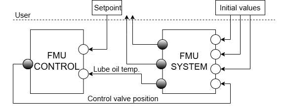

<p align="center">
  <a href="https://novia.fi">
</a>
</p>

<p align="center">
    <b>OPC-UA and FMU Simulator</b> <br />
    Perform X-in-the-Loop (XiL) simulation tests with FMU simulation models and communication over OPC-UA.
</p>

<p align="center">
  <a href="https://www.novia.fi/" target="_blank">
      Novia UAS
  </a>|
  <a href="https://www.utu.fi/en" target="_blank">
      University of Turku
  </a>|
  <a href="https://www.virtualseatrial.fi/" target="_blank">
      Research Project
  </a>|
  <a href="mailto:mikael.manngard@novia.fi?subject=MCP-FMI:">Contact</a>

</p>
<p align="center">
  <a href="https://www.python.org/">
    
  </a>
  <a href="https://opensource.org/licenses/MIT">
    
  </a>
  <a href="https://www.businessfinland.fi/">
    
  </a>
</p>

# OPCUA-FMU Simulator

# dev notes

try making parent in function calls the server itself, then we only need to pass in the variable

## tasks
1) universal clock
3) state machines
4) add to value

## in progress

minor: add setters and getters to the server itself and clean it up a bit 


2) zero order hold, signals hold their value constant until changed
goal: make the fmus work with a universal time
for example fmu1 has a timestep of 0.5 seconds while fmu2 has a step of t=1sec

we have a universal clock and timestep

it should loop around the whole thing and whenever enough time has passed we update our values

solution:

every server should have 
- server time
- fmu time
- receive system time

through these we can get the time from the system and update server time
then we check if (server time - fmu time >= step) if that's true we make a step to the fmu 

to do this we'll be calling the fmu step function while passing in the server time variable


## done


# test definition


    tests:
        test_name:
            test_type: 

            test_description: "a description of the test"

            initial_system_state:

            start_readings_conditions:

            system_loop:

    


simply loop after first fmu inputs

loop:
    first inputs = defaults

    first outputs = second input

    second out = first in


alllow multiple of the same fmu by adding id's to the end

# system

System Diagram


FMU architecture and IOs




## Citation
If you use this package in your research, please cite it using the following BibTeX entry:

```bibtex
@misc{MCP-FMU,
  author = {Dimitrios Bouzoulas, Kristian Klemets, Mikael Manngård},
  title = {OPCUA-FMU Simulator},
  year = {2025},
  howpublished = {\url{https://github.com/Novia-RDI-Seafaring/fmu-opcua-test-platform}},
}
```

## Acknowledgements
This work was done in the Business Finland funded project [Virtual Sea Trial](https://virtualseatrial.fi)

## License
This package is licensed under the MIT License license. See the [LICENSE](./LICENSE) file for more details.