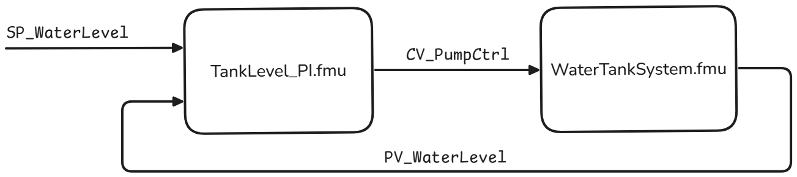
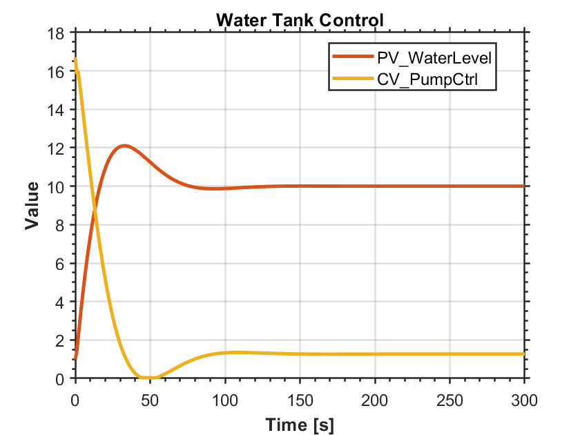

## Example 1: exp1_water_tank.yaml 
Let's take a look on this example system created by Mathworks: [Watertank Model](https://mathworks.com/help/slcontrol/ug/watertank-simulink-model.html) 

The model consists of a **WaterTankSystem** and a **PI-controller** connected in a feedback loop. 
The goal of this system is for the PI-controller to maintain the water level in the tank as close as possible to a defined setpoint (`SP`). It does this by adjusting the voltage applied to a pump (`CV`), which controls the inflow of water, while continuously receiving measurements (`PV`) from the WaterTankSystem.

Both systems have been implemented as FMUs: `WaterTankSystem.fmu` and `TankLevel_PI.fmu`.  

- **TankLevel_PI.fmu** (the PI controller) has two inputs:  
  - `SP_WaterLevel` — the **setpoint (SP)** that the controller aims to reach.  
  - `PV_WaterLevel_in` — the **process value (PV)**, i.e., the current water level measurement from the WaterTankSystem’s output `PV_WaterLevel_out`.  

  Its output is:  
  - `CV_PumpCtrl_out` — the **control value (CV)** that drives the pump to adjust the water inflow.  

- **WaterTankSystem.fmu** has one input:  
  - `CV_PumpCtrl_in` — the **control value (CV)** from the PI-controller.  

This creates a closed-loop system where:
<p align="center">

</p>
This can now be configred in the configuration file as follows:

```yaml
fmu_files: ["FMUs/WaterTankSystem.fmu",
            "FMUs/TankLevel_PI.fmu"]

external_servers: []

test:
  test_name: Water Level Control      # Scenario name for logs
  timestep: 1                         # seconds, communication timestep
  timing: "simulation_time"           # simulation_time or real_time 
  stop_time: 300.0                    # seconds 
  save_logs: true                     # true/false

  initial_system_state:               # Define timestep and initial conditions
    
    WaterTankSystem:                  # Model description -> "Model name"
      timestep: 0.2                   # This has to be defined for every fmu
    
    TankLevel_PI:             
      timestep: 1
      SP_WaterLevel_in: 10            # Input for the TankLevel_PI    

  start_readings_conditions: 
    condition_01: "TankLevel_PI.CV_PumpCtrl_out > 0.01" # Logging starts, when this condition is met

  # The system loop is made according to the block diagram  
  system_loop: 
    - from: TankLevel_PI.CV_PumpCtrl_out
      to:   WaterTankSystem.CV_PumpCtrl_in
    
    - from: WaterTankSystem.PV_WaterLevel_out
      to:   TankLevel_PI.PV_WaterLevel_in

  # These values are logged and they also return true/false depending if the condition is satisfied
  evaluation: 
    eval_1: "WaterTankSystem.PV_WaterLevel_out < 11.1"
    eval_2: "TankLevel_PI.CV_PumpCtrl_out < 20"

```
This is already setup on the file `exp1_water_tank.yaml`, to run this simply just call:

```
uv run experiments exp1_water_tank.yaml
```
The `.log` file is in `.csv` format and the results are easy to plot. In this particular scenario they should look something like this:
<p align="center">

</p>